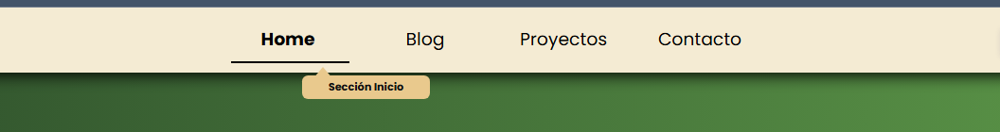

# ToolTip UI

En este proyecto, se le pedirá que cree un tooltip que aparezca sobre los elementos de navegación al pasar el ratón por encima, utilizando sólo HTML y CSS. Un tooltip es un pequeño cuadro emergente que proporciona información adicional sobre un elemento de navegación cuando el usuario pasa el ratón por encima de él. Este proyecto se centrará en dominar el posicionamiento CSS, los efectos hover y la creación de tooltips visualmente atractivos sin depender de JavaScript.

El objetivo de este proyecto es ayudarle a comprender cómo utilizar CSS para crear efectos de interfaz de usuario dinámicos. Aprenderás a posicionar elementos entre sí, crear transiciones suaves y hacer que tu navegación sea más interactiva y fácil de usar. A continuación se muestra una maqueta que muestra la información sobre herramientas que aparece por encima de un elemento de navegación.

<figure>
    
    <figcaption style="text-align:center;">Figura 1. Mockup Tooltip</figcaption>
</figure>

## Solución
Se implemento el tooltip en un menu de navegación, el tooltip se realizo con los pseudo-elementos ::after(contenedor) y ::before(triangulo). Se le aplico una transicion de visibilidad y opacidad.
<figure>
    
    <figcaption style="text-align:center;">Figura 2. Menu implementado con tooltip</figcaption>
</figure>

*Página realizada por Alfredo Jiménez.*

https://roadmap.sh/projects/tooltip-ui

*02-Julio-2025*
