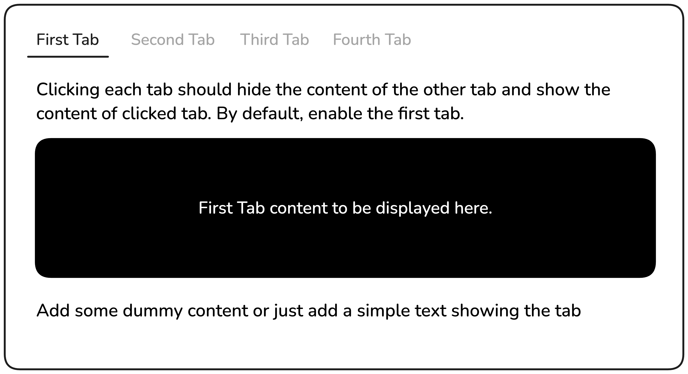

# Tabs

Este proyecto está diseñado para introducirte en la manipulación básica del DOM y el manejo de eventos en JavaScript.

Se le pedirá que cree una funcionalidad sencilla de pestañas utilizando HTML, CSS y JavaScript básico. La página tendrá cuatro pestañas, con la primera activa por defecto. Cuando el usuario haga clic en otra pestaña, el contenido de la pestaña actual se ocultará y se mostrará el contenido de la pestaña seleccionada.

<figure>
    
    <figcaption style="text-align:center;">Figura 1. Mockup: Tab</figcaption>
</figure>

# Solución 
<figure>
    
    <figcaption style="text-align:center;">Figura 2. Implementación realizada</figcaption>
</figure>
Se implemento las tabs en un menu que permite mostrar contenido del tamaño del viewport sin scroll, se realizo seleccionando una consulta de las clases .tab y .tab-content ya que al ser las misma cantidad se puede recorrer la lista generada de ambas partes, recorremos el array de consulta de clases tabs y colocamos un listener para el evento click en cada tab para que elimine/remueva la clase active tanto de tabs como de tab.content,
y luego al salir de ese evento click, inserta/agrega la clase al elemento que escucho el evento click.++

- .tab-content.active:
    Esta clase permite la visualizacion de contenido, se hizo de dos formas, a traves de la propiedad opacity para ocultar todas las tab-content y solo la que tuviera la clase active tuviera opacity=1, asi solo visualizando un contenedor.
- .tab.active:  
    Esta clase permite visualizar que tab tenemos seleccionada con efectos en css se le da un efecto que visualice que tab tiene seleccionando el usuario, en caso de pasar el raton sobre un tab se tiene un efecto hover, si el usuario selecciona el tab se le añade con la clase active una seleccion de estilos diferente al resto.

*Página realizada por Alfredo Jiménez.*

https://roadmap.sh/projects/simple-tabs

*05-Julio-2025*