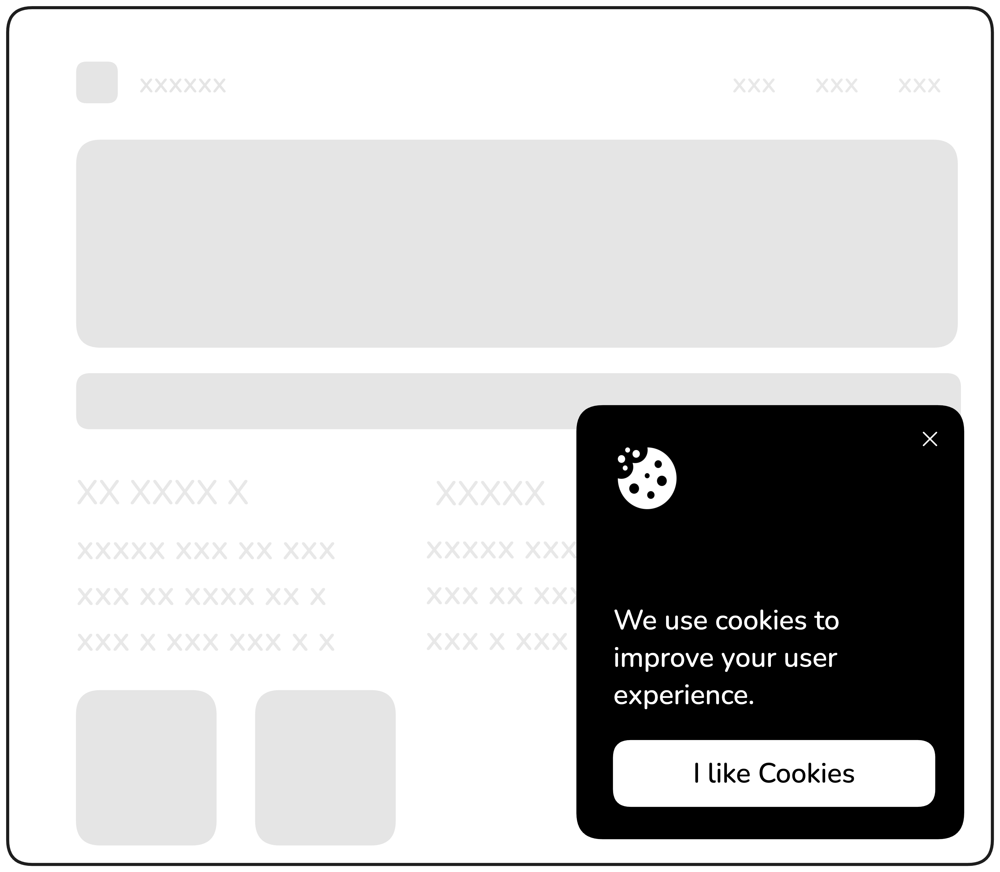
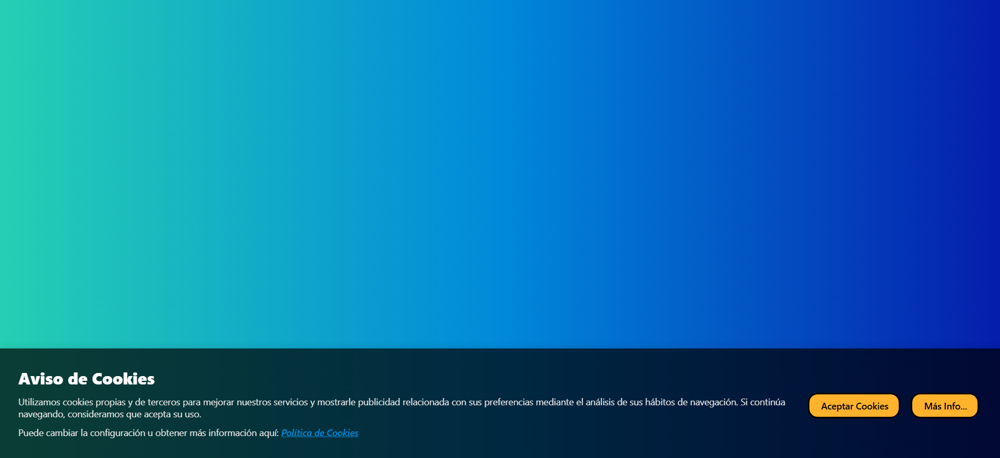
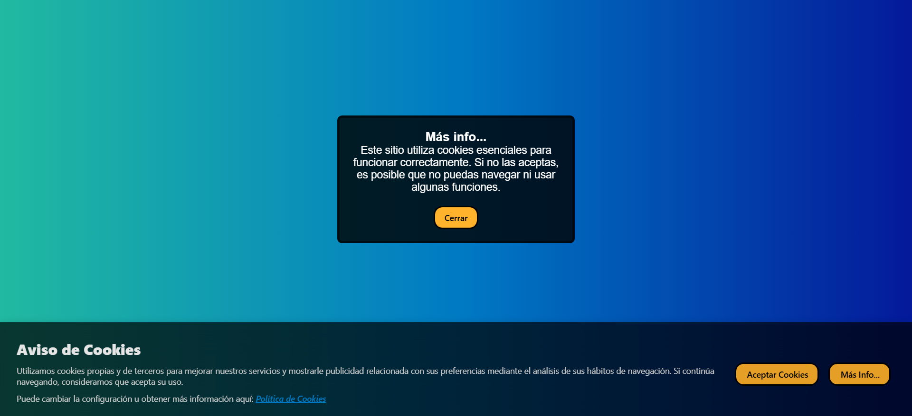

# Cookie Consent
Este proyecto está diseñado para introducirte en la manipulación básica del DOM y el manejo de eventos en JavaScript.

Muchos sitios web muestran una ventana emergente de consentimiento de cookies para informar a los usuarios sobre el uso de cookies y obtener su consentimiento. En este proyecto, usted creará una simple ventana emergente de consentimiento de cookies que aparecerá cuando el usuario visite la página. La ventana emergente incluirá un mensaje y un botón para aceptar el consentimiento. Una vez aceptado, el popup desaparecerá. A continuación se muestra un ejemplo de cómo podría ser la ventana emergente:

<figure>
    
    <figcaption style="text-align:center;">Figura 1. Mockup: Cookie Consent</figcaption>
</figure>
Puntos extra si mantiene el consentimiento del usuario mediante cookies o almacenamiento local y evita que la ventana emergente aparezca en visitas posteriores.

# Solución
<figure>
    
    <figcaption style="text-align:center;">Figura 2. Implementación realizada</figcaption>
</figure>
 Se implemento un modal en modo fixed en el bottom, el modal cuenta con dos botones, uno para aceptar el uso de cookies, al dar clic se genera una cookie, y desaparece el modal con una transicion desapareciendo hacia abajo de la pantalla, y se creo un boton de ver mas que muestra un segundo modal notificandole al usuario el uso de las cookies parale funcionamiento correcto de la pagina

<figure>
    
    <figcaption style="text-align:center;">Figura 2. Implementación realizada</figcaption>
</figure>

https://roadmap.sh/projects/cookie-consent

*Página realizada por Alfredo Jiménez.*

*Versión no completa
*-Julio-2025*